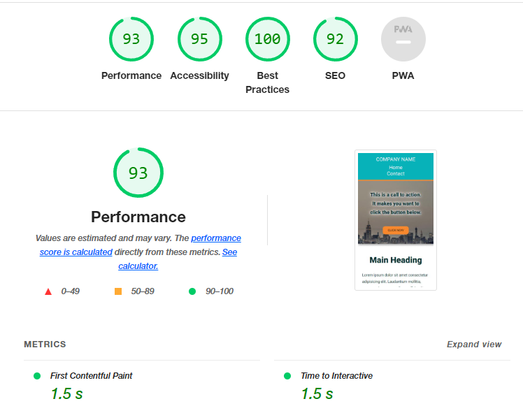

# m9-hw9-christensen-kristine
Assignment 9: Creating a Mobile-Responsive Website

## About This Assignment ##
This assignment required that we: 
1. Fix the header links to match the mockups.
2. Fix the article element's padding to allow text to be readable on smaller 
screens.
3. Fix the hero image's text so that it is not overly large on smaller devices.
4. Center the image embedded in the article's text.
5. Decrease the bottom margin on the different sections of the page.

## Lighthouse Report ##
